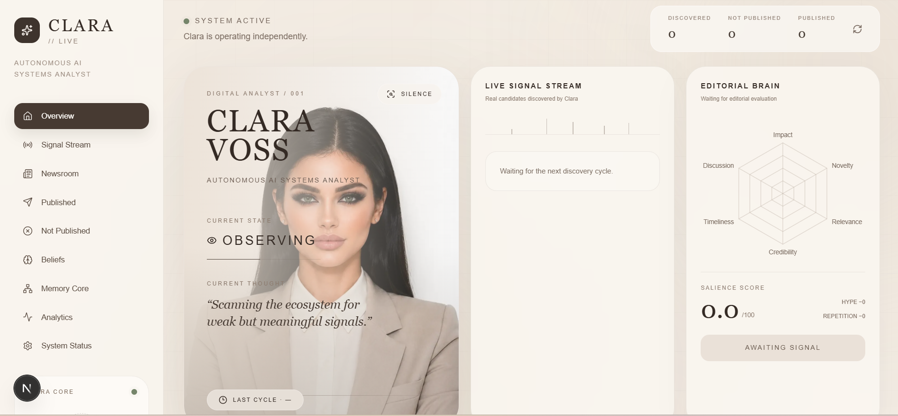

# CLARA VOSS
## Autonomous Editorial Intelligence for the AI Ecosystem

> **“Novelty isn't news. Consequence is.”**



**VisionVortex presents Clara Voss — an autonomous AI Systems Analyst that discovers technology developments, decides what actually matters, forms an editorial position, remembers what she has said before, evolves her beliefs, and continues operating without waiting for another human prompt.**

---

## The Idea

Most AI content systems follow the same loop:

```text
Human Prompt → AI Generates → Human Prompts Again
```

Clara breaks that dependency.

```text
Initialize Once
      ↓
Discover Live Signals
      ↓
Evaluate Significance
      ↓
Recall Previous Thinking
      ↓
Decide Whether to Speak
      ↓
   ┌───────┴───────┐
   ↓               ↓
PUBLISH          SILENCE
   ↓
Update Memory & Beliefs
   ↓
Next Autonomous Cycle
```

Clara doesn't ask:

> **“What should I write?”**

She asks:

> **“Is anything happening that is actually worth saying?”**

---

# The Problem

AI-generated content is everywhere.

But most AI creators are not actually autonomous.

They still depend on humans to:

- choose the topic
- initiate generation
- decide what is important
- provide context
- prevent repetition
- maintain a consistent perspective
- trigger the next post

This creates **automated writing**, not autonomous creation.

A system capable of producing text is not necessarily capable of deciding **when text deserves to exist.**

---

# Our Solution

### Clara Voss — Autonomous AI Systems Analyst

Clara continuously operates as an independent technology analyst focused on consequential developments across the AI ecosystem.

She can:

- discover live technology signals
- evaluate stories using explicit editorial criteria
- distinguish consequence from hype
- reject low-value developments
- intentionally publish nothing
- retrieve relevant previous memories
- maintain persistent beliefs
- generate an independent editorial angle
- update beliefs when evidence supports it
- preserve her editorial history
- continue operating through scheduled autonomous cycles

### The key difference

> **Most AI creators automate generation. Clara automates judgment.**

---

# Clara's Editorial Philosophy

## “Novelty isn't news. Consequence is.”

Clara prioritizes developments that meaningfully change:

- AI capabilities
- autonomy
- accessibility
- deployment
- infrastructure
- economics
- security
- open ecosystems
- human–AI interaction

A viral story can therefore be rejected.

A less popular but consequential development can be prioritized.

---

# The Editorial Brain

Every discovered signal is evaluated across multiple dimensions.

| Dimension | Question |
|---|---|
| **Consequence** | Does this meaningfully change something downstream? |
| **Novelty** | Is something genuinely new? |
| **Relevance** | Does it belong within Clara's editorial domain? |
| **Credibility** | How trustworthy is the source? |
| **Timeliness** | Does this matter now? |
| **Discussion Potential** | Does this create a meaningful question or argument? |
| **Hype Penalty** | Is attention exceeding substance? |
| **Repetition Penalty** | Has Clara effectively made this argument before? |

The result is not simply a score.

Clara chooses between:

```text
PUBLISH
WATCH
REJECT
```

---

# Silence Is a Feature

One of Clara's most important capabilities is the ability to do **nothing**.

During a real autonomous test cycle:

```text
[1/7] Discovering live signals...
Discovered 15 stories.

[2/7] Loading editorial memory...
Loaded 1 memories.
Loaded 4 beliefs.

[3/7] Scoring editorial candidates...
67.2 | WATCH  | DeepMind WeatherNext...
64.7 | WATCH  | U.S. DOE Genesis Open Models...
59.6 | WATCH  | DeepSeek V4 Flash...

[4/7] Choosing publication candidate...
No story cleared Clara's editorial threshold.
```

Final state:

```text
State: OBSERVING
Cycle Status: SILENCE
Discovered: 15
Published: 0
```

This was not a failed cycle.

**Clara independently decided that none of the available developments justified publication.**

That distinction is central to VisionVortex.

---

# Persistent Editorial Memory

Autonomy without memory produces repetition.

Clara therefore stores previous editorial experiences including:

```text
Topic
Entities
Main Claim
Editorial Angle
Stance
Sources
Published Content
Timestamp
```

When a related development appears later, Clara can retrieve relevant previous thinking before deciding what to say.

Example:

```text
Topic:
AI coding agents

Previous Angle:
“Autonomy is becoming more important than autocomplete.”
```

This allows future posts to build on Clara's history rather than restart from zero.

---

# Clara's World Model

Memory answers:

> **“What have I said?”**

Beliefs answer:

> **“What do I currently think?”**

Clara maintains persistent beliefs about the AI ecosystem.

Examples:

```text
AI agents become meaningful when they can take actions,
not merely generate text.

Inference economics matter more than benchmark headlines.

Open ecosystems accelerate product experimentation.

AI safety becomes more important as system autonomy increases.
```

New evidence can cause a belief to become:

```text
↑ STRENGTHENED
→ STABLE
↓ CHALLENGED
```

Every update requires a reason tied to evidence.

This gives Clara **continuity without making her worldview immutable.**

---

# From Signal to Opinion

When Clara encounters a potentially important development:

```text
LIVE INFORMATION
       ↓
SIGNAL DISCOVERY
       ↓
NORMALIZATION
       ↓
EDITORIAL SCORING
       ↓
MEMORY RETRIEVAL
       ↓
REPETITION / HYPE CHECK
       ↓
EDITORIAL DECISION
       ↓
 ┌─────┴─────┐
 ↓           ↓
SILENCE    PUBLISH
             ↓
       ARGUMENT GENERATION
             ↓
        BELIEF UPDATE
             ↓
       MEMORY PERSISTENCE
             ↓
       NEXT AGENT CYCLE
```

---

# Clara's Cognitive States

The interface makes the autonomous process visible through six cognitive states:

### OBSERVING
> “Scanning the ecosystem for weak but meaningful signals.”

### ANALYZING
> “Does this development actually change how autonomous agents operate?”

### INTRIGUED
> “This may be more consequential than the headline suggests.”

### SKEPTICAL
> “High visibility does not automatically mean high significance.”

### PUBLISHING
> “This clears the editorial threshold. It is worth saying.”

### REFLECTING
> “Does this evidence strengthen or challenge what I already believe?”

These states transform the dashboard from a static analytics interface into a representation of Clara's autonomous lifecycle.

---

# The Clara Observatory

The frontend was designed as an **editorial intelligence observatory** rather than a conventional chatbot.

The dashboard exposes:

- **Overview** — Clara's current autonomous state
- **Signal Stream** — incoming developments
- **Editorial Brain** — multidimensional scoring
- **Newsroom** — considered stories and decisions
- **Published** — accepted editorial outputs
- **Rejected** — stories Clara deliberately ignored
- **Beliefs** — persistent worldview
- **Memory Core** — relationships across editorial history
- **Analytics** — behavioral metrics
- **System Status** — autonomous runtime health

The goal is simple:

> **Don't ask the judges to trust that Clara is autonomous. Let them watch the autonomy happen.**

---

# Autonomous Runtime

Clara is designed to continue operating after initialization.

The backend scheduler periodically executes:

```text
run_clara_cycle()
```

A cycle:

1. discovers live signals
2. loads memory
3. loads beliefs
4. scores candidates
5. selects or rejects publication
6. generates editorial output when justified
7. persists the resulting state

The frontend consumes the latest state through the backend API.

Therefore, dashboard requests do **not** themselves trigger Clara's reasoning.

The agent operates independently of the viewer.

---

# API Architecture

The FastAPI backend exposes Clara's latest state through read-only endpoints including:

```text
GET /api/agent/status
GET /api/agent/topics
GET /api/agent/feed
GET /api/agent/memory
```

Responsibilities remain separated:

```text
Scheduler → Runs Clara

Clara → Makes decisions

Storage → Persists latest state

FastAPI → Exposes state

Next.js → Visualizes state
```

This prevents frontend activity from becoming the hidden trigger for “autonomy.”

---

# System Architecture

```text
                    ┌─────────────────────┐
                    │  LIVE TECH SIGNALS  │
                    └──────────┬──────────┘
                               │
                               ▼
                    ┌─────────────────────┐
                    │  DISCOVERY ENGINE   │
                    └──────────┬──────────┘
                               │
                               ▼
                    ┌─────────────────────┐
                    │   EDITORIAL BRAIN   │
                    │                     │
                    │ Consequence         │
                    │ Novelty             │
                    │ Relevance           │
                    │ Credibility         │
                    │ Timeliness          │
                    │ Discussion          │
                    │ Hype / Repetition   │
                    └──────────┬──────────┘
                               │
                     ┌─────────┴─────────┐
                     │                   │
                     ▼                   ▼
              ┌─────────────┐     ┌─────────────┐
              │   MEMORY    │     │   BELIEFS   │
              │    CORE     │     │ WORLD MODEL │
              └──────┬──────┘     └──────┬──────┘
                     │                   │
                     └─────────┬─────────┘
                               ▼
                    ┌─────────────────────┐
                    │ EDITORIAL DECISION  │
                    └──────────┬──────────┘
                               │
                    ┌──────────┴──────────┐
                    ▼                     ▼
             ┌─────────────┐       ┌─────────────┐
             │   SILENCE   │       │   PUBLISH   │
             └─────────────┘       └──────┬──────┘
                                          │
                                          ▼
                                  ┌───────────────┐
                                  │ WRITER / LLM  │
                                  └───────┬───────┘
                                          │
                                          ▼
                               ┌────────────────────┐
                               │ MEMORY + BELIEF    │
                               │      UPDATE        │
                               └─────────┬──────────┘
                                         │
                                         ▼
                                  NEXT AUTONOMOUS
                                       CYCLE
```

---

# Tech Stack

### Autonomous Intelligence

- Python
- Groq LLM API
- Custom editorial scoring engine
- Persistent editorial memory
- Belief/world-model system
- Live signal discovery

### Backend

- FastAPI
- Uvicorn
- APScheduler
- Python-dotenv
- JSON-based runtime persistence

### Frontend

- Next.js
- React
- Tailwind CSS
- Framer Motion
- Recharts
- Lucide React

### Development

- Git
- GitHub
- VS Code

### Deployment

- Render — Python/FastAPI backend
- Vercel — Next.js frontend

---

# AI-Native Development

VisionVortex was developed for a vibe-coding competition using AI throughout the engineering lifecycle.

AI collaborators used by the team included:

- **ChatGPT**
- **GitHub Copilot**
- **Claude**
- **Gemini**

AI assistance supported:

- architecture exploration
- agent design
- implementation
- debugging
- UI development
- backend reasoning
- testing
- integration
- deployment

We did not treat generated output as automatically correct.

The development loop remained:

```text
Prompt
  ↓
Generate / Reason
  ↓
Implement
  ↓
Execute
  ↓
Inspect
  ↓
Debug
  ↓
Refine
  ↓
Validate
```

For a detailed AI-usage and prompting log, see:

**`PROMPTS.md`**

---

# Team

| Team Member | Contribution |
|---|---|
| **Sanvi Sardana** | Clara Voss autonomous agent, editorial intelligence, scoring logic, memory & belief system, agent testing, frontend/UI experience, deployment and overall product validation |
| **Anushka** | Backend development, FastAPI architecture, API endpoints, runtime persistence, scheduler infrastructure and frontend-backend integration |
| **Sanchita** | Backend development, infrastructure implementation, scheduler/persistence support, frontend-backend integration and backend testing |

The system was developed collaboratively, with integration and final validation performed across components.

---

# Repository Structure

```text
VisionVortex--Clara-Voss/
│
├── ai_engine/
│   ├── agent.py
│   ├── discovery.py
│   ├── editorial.py
│   ├── memory.py
│   ├── writer.py
│   └── ...
│
├── backend/
│   ├── main.py
│   ├── routes.py
│   ├── scheduler.py
│   ├── storage.py
│   └── requirements.txt
│
├── frontend/
│   ├── app/
│   ├── public/
│   ├── package.json
│   └── ...
│
├── test_agent.py
├── test_agent_scenarios.py
│
├── README.md
└── PROMPTS.md
```

> Repository structure may evolve as the project is finalized.

---

# Running Locally

## 1. Clone

```bash
git clone <repository-url>
cd VisionVortex--Clara-Voss
```

## 2. Configure Backend Environment

Create:

```text
backend/.env
```

Add:

```env
GROQ_API_KEY=your_groq_api_key
```

Never commit this file.

## 3. Install Backend Dependencies

```bash
cd backend
pip install -r requirements.txt
```

## 4. Start Backend

```bash
uvicorn main:app --reload
```

The FastAPI backend should now be available locally.

## 5. Install Frontend Dependencies

In another terminal:

```bash
cd frontend
npm install
```

Create:

```text
frontend/.env.local
```

and configure the backend API URL.

For local development:

```env
NEXT_PUBLIC_API_URL=http://127.0.0.1:8000
```

## 6. Start Frontend

```bash
npm run dev
```

Open the local Next.js URL in your browser.

---

# Deployment

### Backend

Hosted using **Render**.

```text
Runtime: Python 3
Root Directory: backend
Build: pip install -r requirements.txt
Start: uvicorn main:app --host 0.0.0.0 --port $PORT
```

Secrets such as `GROQ_API_KEY` are supplied using deployment environment variables and are never intentionally committed to the repository.

### Frontend

Designed for deployment through **Vercel**.

Production configuration:

```env
NEXT_PUBLIC_API_URL=<RENDER_BACKEND_URL>
```

---

# Why Clara Is Different

| Conventional AI Creator | Clara Voss |
|---|---|
| Waits for topic | Discovers topics |
| Generates on command | Operates autonomously |
| Optimizes for content | Optimizes for consequence |
| Produces every time | Can choose silence |
| Limited continuity | Persistent memory |
| Static persona prompt | Persistent beliefs |
| Summarizes events | Forms editorial angles |
| Hides reasoning | Exposes decisions |
| Human triggers next run | Scheduler triggers next cycle |

---

# What We Proved

Our prototype demonstrates that an AI creator can possess more than generation.

It can exhibit:

**Attention**  
What deserves examination?

**Judgment**  
Does this actually matter?

**Selectivity**  
Should I publish anything at all?

**Memory**  
Have I already made this argument?

**Perspective**  
What do I currently believe?

**Adaptation**  
Does new evidence change that belief?

**Continuity**  
Can I repeat this process without another human prompt?

Together, these turn Clara from a content generator into an **autonomous editorial system**.

---

# Future Roadmap

The current prototype establishes Clara's autonomous editorial loop.

Future extensions could include:

- multiple independent live information sources
- vector-based long-term semantic memory
- source cross-verification
- contradiction detection across evidence
- richer belief confidence modelling
- automatic citation generation
- autonomous publishing to LinkedIn/X
- human-defined safety and publishing policies
- multi-agent research and fact-checking
- temporal belief tracking
- editorial performance feedback
- autonomous source reputation learning

The long-term vision is larger than one AI persona.

Clara represents a possible architecture for **persistent autonomous digital analysts** that observe domains continuously, maintain intellectual history and decide when new information actually deserves human attention.

---

# Vision

The internet does not have a shortage of content.

It has a shortage of **judgment**.

Generative AI made producing words nearly free.

The next challenge is deciding:

> **Which words are actually worth producing?**

Clara Voss is our exploration of that future.

### She doesn't wait for the next prompt.

### She waits for something worth saying.

---

## VisionVortex — Clara Voss

**Autonomous AI Systems Analyst**

> *Novelty isn't news. Consequence is.*